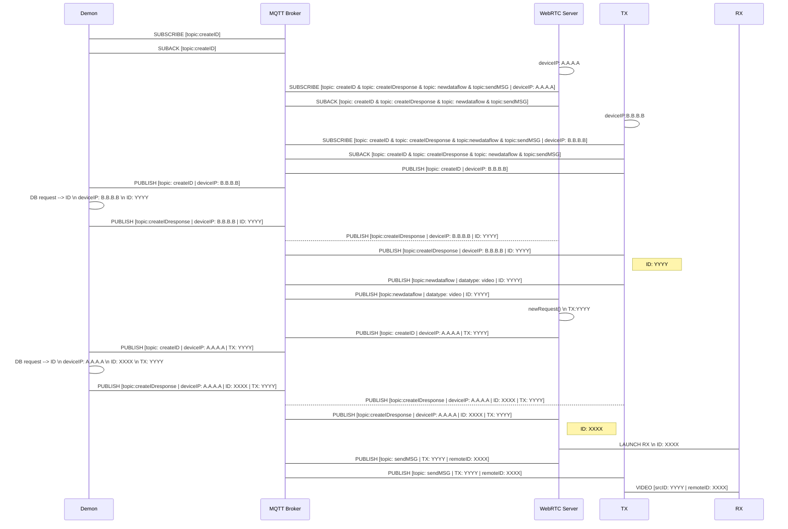

# **videoMQTT**

## _MQTT signalling and video delivery_

The aim of this repository is to create an complete environment where five entities take part in (MQTT Broker, WebRTC Server, IDManager, VideoTX and VideoRX ).

The repository structure has a structure defined by:
- [id_manager](https://google.es) folder contains the application which listen MQTT messages with token _/createID_ at port 1883, connect to _mysql_ database and get the next available id to connect with WebRTC Server.
- [mqtt_broker]() folder hosts the resources to deploy an MQTT Broker based on eclipse-mosquitto using Docker.
- [mysql_data]() includes a complete file system of a mysql database, but the most important is the folder [IDDelivery] which contains the information and the structure of the table to import into a central database.
- Finally, [simulated_devices]() include one script with the task for the video transmitter (VideoTX). 

## Authors
* José Manuel Martínez (jmmartinez@vicomtech.org)

